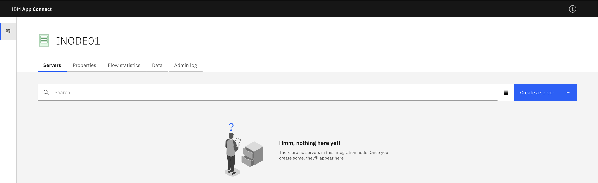
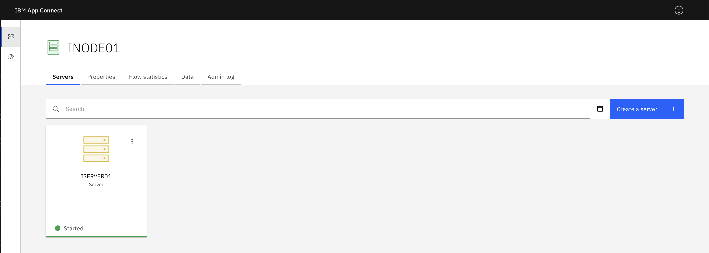

# Getting started App Connect Enterprise on Red Hat Linux

## Before you start

1. Prequisites [link](https://www.ibm.com/software/reports/compatibility/clarity-reports/report/html/softwareReqsForProduct?deliverableId=17D73B93A5CB43DB95086455B2A2B747&osPlatforms=spcrAllValues&duComponentIds=spcrAllValues&mandatoryCapIds=spcrAllValues&optionalCapIds=spcrAllValues)

   - Red Hat Enterprise Linux (RHEL) 9 x86-64 (Update 9.6)
   - CPU: 2 vCPU
   - Mem: 8 GB
   - Disk: 50 GB

1. Check if SELinux is enabled
   ```
   sestatus
   ```

   If enabled, review this [page](https://www.ibm.com/support/pages/node/6406668)

1. Security requirements in Linux
   
   *To deploy a shared installation of IBM App Connect Enterprise on Linux or UNIX systems, you must log in as root or as a super user who has write access to the /var directory. After the deployment, a security group that is called mqbrkrs is created (if this group does not already exist). To enable users to use the shared installation of IBM App Connect Enterprise, add the users to the mqbrkrs group by using the security facilities that are provided by your operating system.*

1. Ensure large enough /tmp folder (50MB per integration server)

1. Download latest installation image with fixpack from [Fix Central](https://www.ibm.com/support/pages/node/7242770)

## Installation 

[IBM Doc reference](https://www.ibm.com/docs/en/app-connect/13.0.x?topic=software-installing-linux)

1. For shared installation, login as
   - root
   - non-root user who is a member of mqbrkrs and has write access to the `/var/mqsi` directory.

1. Use target instalation folder /opt/IBM
   ```
   mkdir -p /opt/IBM
   ```

1. Unpack installation image
   ```
   tar xzf 13.0-ACE-LINUXX64-13.0.4.2.tar.gz
   ```
   If no IBM App Connect Enterprise Toolkit
   ```
   tar xzf 13.0-ACE-LINUXX64-13.0.4.2.tar.gz --exclude ace-13.0.n.0/tools
   ```
   If no IBM App Connect Enterprise Connector Discovery and OpenAPI Editor
   ```
   tar xzf 13.0-ACE-LINUXX64-13.0.4.2.tar.gz --exclude ace-13.0.n.0/tools/tkelectronapp
   ```
   If no WebSphere Service Registry and Repository nodes
   ```
   tar xzf 13.0-ACE-LINUXX64-13.0.4.2.tar.gz --exclude ace-13.0.n.0/server/wsrrcomponent
   ```
   If no IBM App Connect Enterprise Cloud Connectors
   ```
   tar xzf 13.0-ACE-LINUXX64-13.0.4.2.tar.gz --exclude ace-13.0.n.0/server/nodejs_all
   ```

1. Move the extracted folder to target install folder.
   ```
   mv ace-13.0.4.2 /opt/IBM
   ```

1. Accept license for shared installation. 

   - The folder `/var/mqsi` will be created for all the configuration files.
   - Group 'mqbrkrs' will be created
   - Key/certificate pair created for admin ssl
   - Key/certificate pair created for HTTPSConnector
   ```
   cd /opt/IBM/ace-13.0.4.2
   ./ace make registry global accept license 
   ```

1. (Optional) Add other users in `mqbrkrs` user group.
   
## Setup MQSI profile

1. Setup MQSI profile
   ```
   . /opt/IBM/ace-13.0.4.2/server/bin/mqsiprofile
   
   MQSI 13.0.4.2
   /opt/IBM/ace-13.0.4.2/server
   ```
   

## Create integration node

1. Create an integration node called `INODE01`.
   ```
   ibmint create node INODE
   BIP8071I: Successful command completion.
   ```

1. Verify configuration file(s) created.
   ```
   ls -l /var/mqsi/components/INODE01/node.conf.yaml
   ```

1. Start integration node.
   ```
   ibmint start node INODE01
   BIP8873I: Starting the component verification for component 'INODE01'.
   BIP8096I: Successful command initiation, check the system log to ensure that the component started without problem and that it continues to run without problem.
   ```

1. Verify integration node is started - the ACE web console should be up and running. Open a browser to

   ```
   https://<hostname>:4414
   ```

   

## Create integration server

1. Create integration server called `ISERVER01`.
   ```
   ibmint create server ISERVER01 --integration-node INODE01
   BIP1124I: Creating integration server 'ISERVER01' on integration node 'INODE01'... 
   BIP1117I: The integration server was created successfully.
   ```

1. Start integration server
   ```
   ibmint start server ISERVER01 --integration-node INODE01
   BIP1959I: Starting integration server 'ISERVER01' on integration node 'INODE01'... 
   BIP1960I: The integration server 'ISERVER01' on integration node 'INODE01' is reported as started.
   ```
   
1. Verify integration server is started in the ACE console.

   

## (Optional) Configure existing integration node with external vault

1. Create an external vault.
   ```
   mkdir -p /var/mqsi/vault
   
   ibmint create vault /var/mqsi/vault --external-directory-vault-key <password>
   ```

1. Stop existing integration node.
   ```
   ibmint stop node INODE01
   ```

1. Override node.conf.yaml to add the following lines to associate the integration noode with an external vault
   ```
   vi /var/mqsi/components/INODE01/overrides/node.conf.yaml

   Credentials:
     ExternalDirectoryVault:
       directory: '/var/mqsi/vault'
   ```

1. Start integration node - this time you need to specify the vault key
   ```
   ibmint start node INODE01 --external-directory-vault-key Passw0rd!
   
   BIP8873I: Starting the component verification for component 'INODE01'. 
   BIP8096I: Successful command initiation, check the system log to ensure that the component started without problem and that it continues to run without problem.
   ```

## (Optional) Manage credentials in vault

1. Display credential types.
   ```
   ibmint display credential-types
   ```

1. Display credential properties for CICS
   ```
   ibmint display credential-types --credential-type cics --show-auth-type
    
   BIP15343I: Credential properties currently supported for cics are as follows.   
      --auth-type basic --username <arg> --password <arg>
      --auth-type username --username <arg>
   ```

1. Set credentials for CICS.
   ```
   ibmint set credential --credential-type cics --external-directory-vault /var/mqsi/vault --external-directory-vault-key <password> --credential-name cics-cred --auth-type basic --username cicsuser --password <cicspassword>

   BIP15119I: The 'CREATE' action was successful for credential name 'cics-cred' of type 'cics'. 
   BIP8071I: Successful command completion.
   ```

1. Display credentials for CICS.
   ```
   ibmint display credentials --credential-type cics --external-directory-vault /var/mqsi/vault --external-directory-vault-key <password> --credential-name cics-cred
   
   BIP15110I: The credential name 'cics-cred' of type 'cics' contains user name 'cicsuser' from provider 'extdirvault' and has the following properties defined: '**********', authentication type 'basic'. 
   BIP8071I: Successful command completion.
   ```

1. Delete credential for CICS (before that you need to stop the node)
   ```
   ibmint stop node INODE01
   
   ibmint unset credential --credential-type cics --credential-name cics-cred --external-directory-vault /var/mqsi/vault --external-directory-vault-key Passw0rd!
   
   BIP15119I: The 'Delete' action was successful for credential name 'cics-cred' of type 'cics'. 
   BIP8071I: Successful command completion. 
   ```